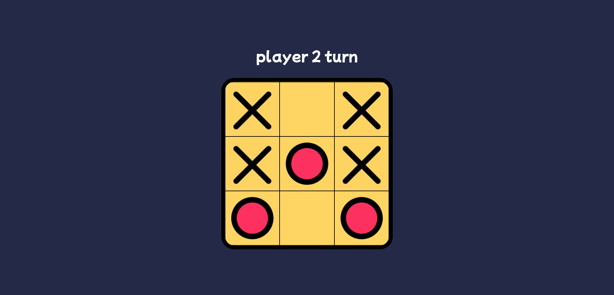

<!-- ABOUT THE PROJECT -->

## About The Project

This is a project i built for the odin project foundation path.

(<a href="#top">back to top</a>)

### Built With

- HTML
- CSS
- javascript

(<a href="#top">back to top</a>)

<!-- Future Goals -->

## Future Goals

- [ ] add AI to the project

(<a href="#top">back to top</a>)

<!-- CONTACT -->

## Contact

Your Name - [muhammed_Y272](https://twitter.com/muhammed_Y272)

Project Link: [tic-tac-toe](https://mohamedyasser27.github.io/tic-tac-toe/)

(<a href="#top">back to top</a>)

<!-- ACKNOWLEDGMENTS -->

## Acknowledgments

- [flaticon](https://www.flaticon.com/)

(<a href="#top">back to top</a>)

